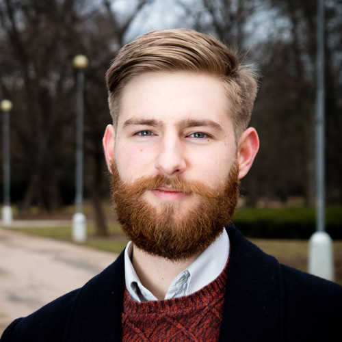

 

# Program

## Introduction to Effective Altruism

Effective altruism is a philosophy and social movement with the goal of
making the world as good as possible as effectively as possible through
reason and scientific thinking.
But why is effective altruism a good idea? What does it mean, to actually <i>be
an effective altruist</i>?

<i>Radim Lacina</i>, a recipient of the prestigious Bakala stipend, will
present an introductory talk in Czech with a description of effective altruism
and of the basic philosophical assumptions and arguments for it.
Radim studies Philosophy and Linguistics at St Hugh's College at the University
of Oxford. Radim has been engaged in the Effective Altruism movement since high
school and co-founded the Czech Association for Effective Altruism.

## Effective development aid

One of the greatest global problems is poverty.
Millions of people in developing countries are plagued by dangerous diseases,
low economical productivity and systematic destruction of the environment.

<!-- TODO: nicer and mobile styling -->

<i>Alix Zwane</i>, an expert on global health and the CEO of <a href="http://www.globalinnovation.fund/">Global Innovation Fund</a>,
will introduce the problem of <b>inventing and implementing effective
interventions for helping the most needy</b>. The Global Innovations Fund
invests into social entrepreneurship projects aiming to improve the lives and
opportunities of millions of people in the developing world. In the past,
Alix worked as the executive director of <a href="http://www.evidenceaction.org/">Evidence Action</a>
and as Senior Program Officer in the global development group at the <a href="http://www.gatesfoundation.org/">Bill and Melinda Gates Foundation</a>,
where she led strategy development for the Water, Sanitation, and Hygiene team.

## What will the future be like? How can we secure a better world for future generations?

The world is undergoing an unprecedented period of accelerating technological
and economical growth. Will the current trajectory lead to a blossoming
civilization and a utopian future, or are we headed for overpopulation,
destructive climate change, or even global thermonuclear war?

<!-- TODO: grid -->

Johannes Treutlein works on growth at the Effective Altruism Foundation and their research division, the Foundational Research Institute. He is responsible for communicating and spreading the idea of Effective Altruism among universities in the German-speaking area. In his talk, he will talk about positive and negative possible future outcomes and what actions can we take today to secure a good future free of suffering.

## How to choose the right career to help the world?

We spend an enormous part of our lives at work. That is why
career selection is so important - by choosing a socially beneficial career,
one can have a huge positive impact. Well, how does one choose?
The enormously important issue of <b>career selection</b> will be explored
by <i>David Goldberg</i>

David realized that making social businesses was hard, and a potentially
higher-leverage strategy might be to make it easier for people who were
founding successful technology businesses to commit to donating the money they
would eventually earn. He says that the ideas of effective altruism (that he
first encountered in Peter Singer's TED talk), earning to give, and the work
of 80,000 Hours in particular, was influential to his thinking and his decision
to choose this route. He founded the Founders Forum for Good, which runs the
<a href="https://founderspledge.com/">Founder's Pledge</a> program that
commits startup founders to donate 2% of their future earnings to effective
charity. By May 2016, the net amount of money pledged through the Founder's
Pledge exceeded <i>$134 million</i>.

## Dysrationalia - Why smart people so stupid things

In his talk, <i>Lucius Caviola</i> will explain that IQ tests don't measure
the amount of rational thinking and decision correctly.
Studies show that a correlation between IQ and a hypothetical "coefficient of rationality"
is weaker than one would expect. Better understanding to rational thinking
can help us to improve rationality itself, which is a necessary ability to
reach our personal and even moral goals.

<i>Lucius Caviola</i> is responsible for the growth of the <a href="https://ea-foundation.org/">Effective Altruism Foundation</a> and <a href="https://sentience-politics.org/">Sentience Politics</a>. He is finishing his PhD at University of Oxford, where he conducts research on the psychology of speciesism and effective altruism, among other topics.

## How can students help the world?

<i>Ollie Base</i> and <i>Nikita Patel</i> work for <a href="http://www.shicschools.org/">Students for High-Impact Charity</a>. 
In their talk, they will present their vision and approaches, how students can help the world. 

<i>Ollie Base</i> is a third year Philosophy with Psychology student, currently studying in Cologne, Germany. Last year, he was president of Effective Altruism Society Warwick and is currently founding a chapter in Cologne. Ollie was on the team which compiled the SHIC curriculum and continues to volunteer remotely on the subject

<i>Nikita Patel</i> recently graduated from the University of Oxford with a BA French and German and used to work as an intern at Giving What We Can. She taught in Austria for a year, before setting up education initiatives for Syrian refugees and for disadvantaged school pupils in Kampala. Currently, she works in <a href="http://www.malariaconsortium.org/">Malaria Consortium</a>.

## Personal advice from experienced effective altruists

During the day,  well-experienced effective altruists
Lucius Caviola and Johannes Treutlein will offer
*slots for one-to-one discussions*. You can choose to talk about any
topic you'd like to talk about: for example, *personalized help with career
selection* or *advice* for your own projects.

# Questions and answers

<dl>
<dt>Effective altruism sounds great - where can I find out more?</dt>
<dd>
We advise you to seek out introductory materials on <a
href="http://www.effectivealtruism.org/">http://www.effectivealtruism.org/</a>
and the book <a href="http://www.effectivealtruism.com/">Doing Good Better</a>
by the eminent philosopher William MacAskill.</dd>
<dt>How much does a ticket cost?</dt>
<dd>
	150 CZK (~$7) for students and people working in the non-profit sector,
	400 CZK (~$17) for everyone else. Thanks to the technical support of
	Paralelní Polis, we <i>accept Bitcoin payments for tickets</i>.
</dd>
</dl>

# Goals

The goal of our conference is to inform the Czech public about how can
we act to have *positive impact on the world*, and how can to guide
our actions in an *effective* manner. In other words: how to accomplish
*the most good with as little resources expended as possible*.
Making the world as good as possible as effectively as possible: that
is *effective altruism*.

We hope to use the EAGxPrague 2016 conference to reach everyone who
wants to benefit others in their life.

# Sponsors

We thank Mr. Jan Bárta for his generous financial support of EAGxPrague.

We sincerely thank <a href="https://www.paralelnipolis.cz/">Paralelní Polis</a>
for providing the spaces for our conference at a highly discounted rate
and for enabling us to accept ticket payments by Bitcoin.

# Questions?

Don't hesitate to contact us at [prague@eaglobalx.com](mailto:prague@eaglobalx.com)
or at the [Czech EA group on Facebook](https://www.facebook.com/groups/efektivnialtruismuscz/505083673035289/).

The conference is organized by [Czech Association for Effective Altruism](http://www.efektivni-altruismus.cz/kontakt).
