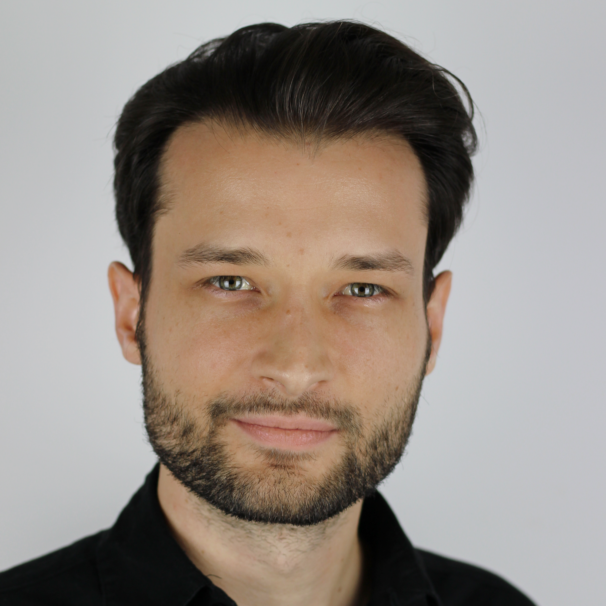

# Participant guide -- What you need to know

Thank you for registering for EAGxPrague, Prague’s first effective altruism-themed conference! We’re very happy to have so many talented and inspiring people coming, and we’re hoping you’ll have a great time.

# Summary
- Arrive to Paralelní Polis at 9 am on Saturday, December 10. The conference ends at 7:10 pm.
- If you have a student or non-profit ticket, please bring some form of student ID or your business card if possible. 
- Some talks will be in English, some in Czech. If you don’t speak Czech, we invite you to chat with us downstairs in the Bitcoin Café during talks in Czech.
- We will provide catering and lunch with vegan options.
- Lucius Caviola and Johannes Treutlein, both highly experienced EAs, will be available for personal EA advice sessions. You can ask them about career advice, ideas for your own projects, or anything else EA-related. Grab your slot <a href="http://tiny.cc/eaadviceprague">here</a>. 
- We’ll be offering discounted copies of the EA career advice book [http://www.effectivealtruism.com/](Doing Good Better) by Will MacAskill. Until December 12, you can also get a <em>free</em> digital copy <a href="http://book.80000hours.org/">here</a>.
- Contact prague@eaglobalx.org with questions.

# Where
The conference takes place at <strong>Paralelní Polis, Dělnická 475/43, 170 00 Praha 7</strong>. (<a href="https://goo.gl/maps/xgPTMmTrFiD2">Google Maps</a>)
It’s close to Prague city centre and we recommend using mass transport to get there.

# Schedule

- 9:00 - Registration. Please <em>arrive sooner rather than later</em>. If you have a student or non-profit ticket, please bring some form of student ID or a business card if possible.
- 9:30 - Welcome speech, Introduction to Effective Altruism (Aleš Flídr, former co-president of Harvard Effective Altruism; Czech)
- 10:30 - Career selection (David Goldberg, founder of Founders Forum for Good; English)
- 11:15 - Coffee break
- 11:45 - Development aid (Alix Zwane, CEO of Global Innovations Fund; English)
- 12:30 - Lunch
- 14:00 - Rationality (Lucius Caviola, co-founder of EA Foundation; English)
- 15:00 - Coffee break
- 15:30 - Moral issues of superheroes -- experimental and philosophic view (Robin Kopecký, researcher at Faculty of Science of Charles University; English)
- 16:00 - Students for High-Impact Charity (Ollie Base, former president of EA Society Warwick, SHIC volunteer; English)
- 16:45 - Coffee break
- 17:15 - Animal welfare (Pablo Stafforini, research at Special Projects Team of Centre for Effective Altruism; English)
- 18:00 - Far future outcomes with a suffering-minimization approach (Johannes Treutlein, Growth at EA Foundation and Foundational Research Institute; English)
- 18:45 - EA in Czech Republic: Goals and plans for 2017 (Czech Association for Effective Altruism; Czech)
- 19:05 - Finishing remarks, networking

After the conference, we’ll be downstairs at the Bitcoin Café for informal discussion and coffee or beer :)

# Contact Information
Please send any questions or feedback both positive or negative to <a href="mailto:prague@eaglobalx.org">prague@eaglobalx.org</a>.

<em>See you at the conference!</em>

-- EAGxPrague Team

 

# Program

## Introduction to Effective Altruism

Effective altruism is a philosophy and social movement with the goal of
making the world as good as possible as effectively as possible through
reason and scientific thinking.
But why is effective altruism a good idea? What does it mean, to actually <i>be
an effective altruist</i>?

<i>Aleš Flídr</i> is an Economics student at Harvard University. In his second year he was a co-president of the Harvard Effective Altruism Club. He worked as an intern in the Centre for Effective Altruism in Oxford. His interests include behavioural economics and philosophy.

## Effective development aid

One of the greatest global problems is poverty.
Millions of people in developing countries are plagued by dangerous diseases,
low economical productivity and systematic destruction of the environment.

<!-- TODO: nicer and mobile styling -->

<i>Alix Zwane</i>
has 20 years of experience working in the development and
environment sectors as a researcher, a strategic advisor on philanthropy, a
social entrepreneur and an investor. She is the CEO of the Global Innovation
Fund, a $200m social first fund that invests to accelerate evidence-based
innovations in global health and development.
 
Alix has worked at the intersection of the evidence and innovation agendas
from a diverse set of posts. She was the first employee and Executive
Director at Evidence Action, a non-profit that develops service delivery
models to scale evidence-based programs. Under Alix’s leadership, Evidence
Action catalyzed school-based deworming for hundreds of millions of
children, and safe drinking water for millions of people in four countries.
Alix has also advocated for evidence-based philanthropy at the Gates
Foundation and Google.org. She designed and developed strategy to support
new public service models that work for the poor.
 
Alix also generates evidence, and has published in Science, PNAS, the QJE
and elsewhere. She holds a PhD in Public Policy from Harvard and is a World
Economic Forum Young Global Leader

## What will the future be like? How can we secure a better world for future generations?

The world is undergoing an unprecedented period of accelerating technological
and economical growth. Will the current trajectory lead to a blossoming
civilization and a utopian future, or are we headed for overpopulation,
destructive climate change, or even global thermonuclear war?

<!-- TODO: grid -->

Johannes Treutlein works on growth at the Effective Altruism Foundation and their research division, the Foundational Research Institute. He is responsible for communicating and spreading the idea of Effective Altruism among universities in the German-speaking area. In his talk, he will talk about positive and negative possible future outcomes and what actions can we take today to secure a good future free of suffering.

## How to choose the right career to help the world?

We spend an enormous part of our lives at work. That is why
career selection is so important - by choosing a socially beneficial career,
one can have a huge positive impact. Well, how does one choose?
The enormously important issue of <b>career selection</b> will be explored
by <i>David Goldberg</i>

David realized that making social businesses was hard, and a potentially
higher-leverage strategy might be to make it easier for people who were
founding successful technology businesses to commit to donating the money they
would eventually earn. He says that the ideas of effective altruism (that he
first encountered in Peter Singer's TED talk), earning to give, and the work
of 80,000 Hours in particular, was influential to his thinking and his decision
to choose this route. He founded the Founders Forum for Good, which runs the
<a href="https://founderspledge.com/">Founder's Pledge</a> program that
commits startup founders to commit 2% of their personal proceeds from exit to the high impact causes they care about. Founders Pledge's total pledge valuation now exceeds <i>$186 000 000</i>.

## Dysrationalia - Why smart people so stupid things

In his talk, <i>Lucius Caviola</i> will explain that IQ tests don't measure
the amount of rational thinking and decision correctly.
Studies show that a correlation between IQ and a hypothetical "coefficient of rationality"
is weaker than one would expect. Better understanding to rational thinking
can help us to improve rationality itself, which is a necessary ability to
reach our personal and even moral goals.

<i>Lucius Caviola</i> is co-founder of the Effective Altruism Foundation (EAF) and coordinates their outreach activities. He studied psychology at the universities of Basel and Oxford and researches in cognitive and moral psychology at the Department for Experimental Psychology and the Uehiro Centre for Practical Ethics at the University of Oxford.

## How can students help the world?

<i>Ollie Base</i> works for <a href="http://www.shicschools.org/">Students for High-Impact Charity</a>. 
In his talk, he will present their vision and approaches, how students can help the world. 

<i>Ollie Base</i> is a third year Philosophy with Psychology student, currently studying in Cologne, Germany. Last year, he was president of Effective Altruism Society Warwick and is currently founding a chapter in Cologne. Ollie was on the team which compiled the SHIC curriculum and continues to volunteer remotely on the subject

## Moral issues of superheroes – experimental and philosophic view

<i>Robin</i> is a PhD student and a researcher at the Faculty of Natural Sciences of Charles University in Prague. He previously studied both philosophy and evolutionary biology and his research interests are moral judgements, experimental philosophy and evolutionary psychology

## Personal advice from experienced effective altruists

During the day,  well-experienced effective altruists
Lucius Caviola and Johannes Treutlein will offer
*slots for one-to-one discussions*. You can choose to talk about any
topic you'd like to talk about: for example, *personalized help with career
selection* or *advice* for your own projects.

# Questions and answers

<dl>
<dt>Effective altruism sounds great - where can I find out more?</dt>
<dd>
We advise you to seek out introductory materials on <a
href="http://www.effectivealtruism.org/">http://www.effectivealtruism.org/</a>
and the book <a href="http://www.effectivealtruism.com/">Doing Good Better</a>
by the eminent philosopher William MacAskill.</dd>
<dt>How much does a ticket cost?</dt>
<dd>
	150 CZK (~$7) for students and people working in the non-profit sector,
	400 CZK (~$17) for everyone else. Thanks to the technical support of
	Paralelní Polis, we <i>accept Bitcoin payments for tickets</i>.
</dd>
</dl>

# Goals

The goal of our conference is to inform the Czech public about how can
we act to have *positive impact on the world*, and how can to guide
our actions in an *effective* manner. In other words: how to accomplish
*the most good with as little resources expended as possible*.
Making the world as good as possible as effectively as possible: that
is *effective altruism*.

We hope to use the EAGxPrague 2016 conference to reach everyone who
wants to benefit others in their life.

# Sponsors

We thank Mr. Jan Barta and Mr. Václav Dejčmar for their generous financial
support of EAGxPrague.

We sincerely thank <a href="https://www.paralelnipolis.cz/">Paralelní Polis</a>
for providing the spaces for our conference at a highly discounted rate
and for enabling us to accept ticket payments by Bitcoin.

# Questions?

Don't hesitate to contact us at [prague@eaglobalx.com](mailto:prague@eaglobalx.com)
or at the [Czech EA group on Facebook](https://www.facebook.com/groups/efektivnialtruismuscz/505083673035289/).

The conference is organized by [Czech Association for Effective Altruism](http://www.efektivni-altruismus.cz/kontakt).
