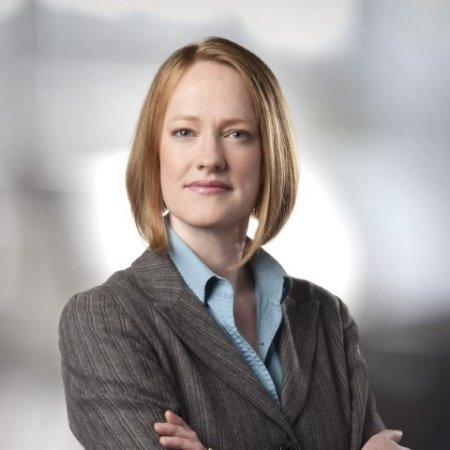
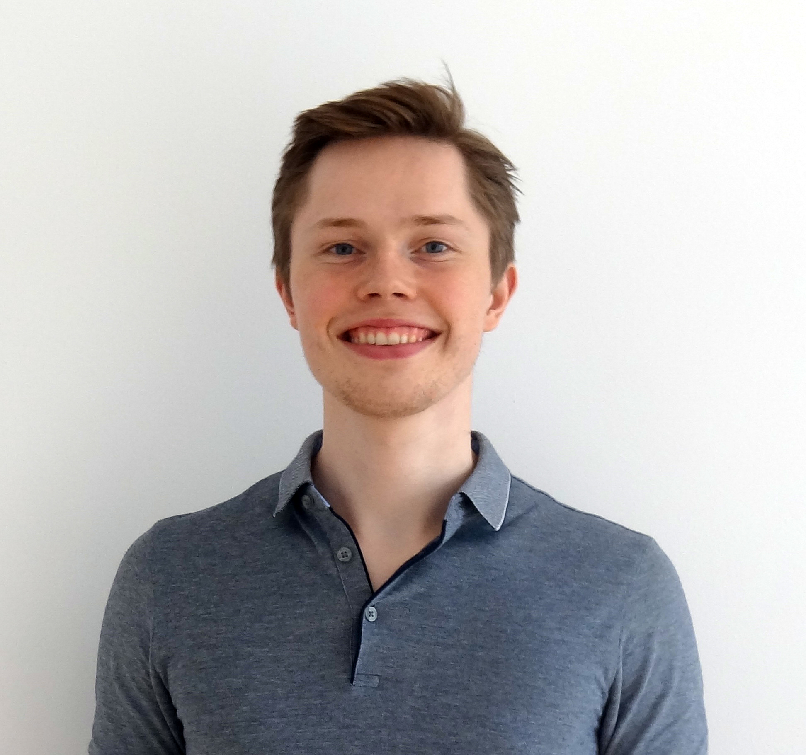
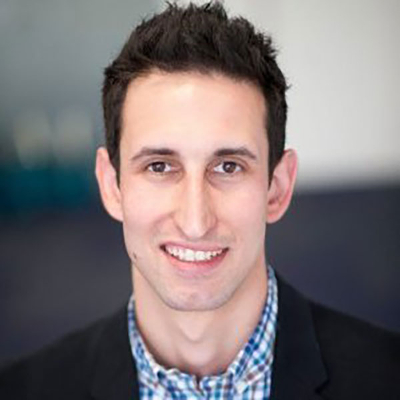
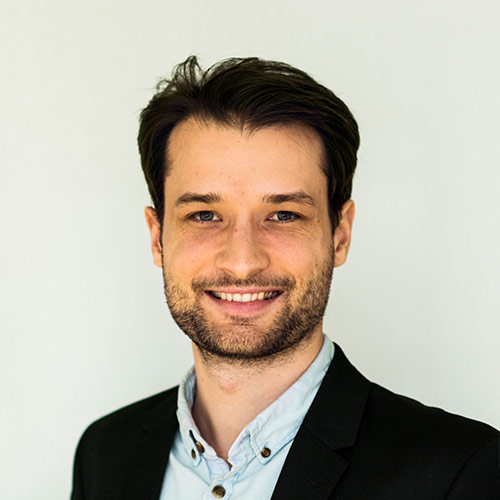
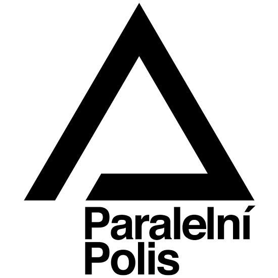

# Program

## Efektivní pomoc nejpotřebnějším

Jeden z největších a nejznámějších globálních problémů je chudoba.
Miliardy obyvatel rozvojových zemí jsou stíhány nebezpečnými nemocemi, nízkou
ekonomickou produktivitou a systematickým znečišťováním životního prostředí.

<!-- TODO: nicer and mobile styling -->

	<!--style="width: 180px;"> -->

S problematikou <b>výběru a implementace efektivních intervencí pro pomoc
nejpotřebnějším</b> nás seznámí
<i>Alix Zwane</i>, expert na veřejné zdraví a CEO Global Innovation Fund, <!-- TODO link -->
fondu investujícího do sociálního podnikání s cílem zlepšit životy a
příležitosti milionů lidí v rozvojovém světě. V minulosti pracovala jako
výkonná ředitelka Evidence Action <!-- TODO link --> a jako Senior Program
Officer ve skupině pro globální rozvoj v Nadaci Billa a Melindy Gates,
kde vedla vývoj strategií pro tým Water, Sanitation, and Hygiene.

## Jaká bude naše budoucnost? Jak můžeme dalším generacím přenechat lepší svět?

Svět dnes prochází nebývalou periodou zrychlujícího se technologického
a ekonomického pokroku. Povede současný vývoj k rozkvětu civilizace a krásné
budoucnosti, nebo k přelidnění, destruktivním změnám klimatu, nebo dokonce
k jaderné válce?

<!-- TODO: grid -->

<i>Johannes Treutlein</i> je odpovědný za růst <a href="https://sentience-politics.org/">Sentience Politics</a>,
organizace, jejímž cílem je snižování utrpení všech rozumných bytostí.
Kromě toho pracuje na komunikaci a šíření myšlenky Efektivního Altruismu
mezi ochránci zvířat. Ve své přednášce bude mluvit o <b>pozitivních a negativních
scénářích naší budoucnosti</b> a <b>jak můžeme dnes zlepšovat šanci, aby
naše společná budoucnost byla co nejlepší</b>.

## Jak vybrat kariéru, kterou co nejvíc pomůžeme světu?

Ohromnou část svého života trávíme v práci. Kvůli tomu je výběr naší
kariéry nebývale důležité rozhodnutí. Na příkladech jako Bill Gates se dá
ukázat, že zvolíme-li si tu správnou práci, můžeme skrz ni zlepšit nebo
zachránit mnoho lidských životů.
Ale jak si vybrat? Měla bych se stát lékařkou, nebo bych se mohla stát
podnikatelkou a svým výdělkem financovat tři jiné lékaře?

Výběr kariéry je velmi důležité rozhodnutí, které je snadné učinit bez tak
opatrného výběru a přemýšlení, jaké by si rozhodnutí takové velikosti
zasloužilo. Strategiemi pro <b>výběr kariéry, kterou pomůžeme ostatním</b>,
nás provede <i>David Goldberg</i>.
David osobně změnil svou kariéru: skončil studium v PhD programu, kterým by,
jak usoudil, měl pouze malý pozitivní vliv na svět. Založil organizaci Founders
Forum for Good, jejíž program <a href="https://founderspledge.com/">Founder's Pledge</a>
přesvědčuje zakladatele
budoucích úspěšných startupů, aby věnovali 2% svých budoucích výdělků na
efektivní charitu. Ke květnu 2016 bylo přes tento program přislíbeno již
<i>134 milionů dolarů</i>.

## Dysracionalie - Proč inteligentní lidé dělají špatná rozhodnutí

Proč někteří lidé dělají špatná rozhodnutí? Ve své přednášce <i>Lucius Caviola</i>
vysvětlí, že testy inteligence neměří správně míru racionálního myšlení a
rozhodování. Studie naznačují, že korelace mezi IQ a hypotetickým "koeficientem
racionality" je slabší, než by se dalo očekávat. Lepší porozumění psychologii
racionálního myšlení nám pomůže lépe měřit a zlepšovat racionalitu, což je
schopnost nutná k efektivnímu dosahování našich osobních i morálních cílů.

<i>Lucius Caviola</i> je odpovědný za růst organizací <a href="https://ea-foundation.org/">Effective Altruism Foundation</a>
a <a href="https://sentience-politics.org/">Sentience Politics</a>. Dokončuje
svá PhD studia na University of Oxford, kde se věnuje kromě jiných témat
výzkumu psychologie speciesismu a efektivního altruismu.

## Jak mohou světu pomoci studenti

Ollie & Nikita

TODO TODO

## Osobní rady od zkušených efektivních altruistů

V průběhu dne budou Lucius Caviola a Johannes Treutlein poskytovat
*sloty na osobní setkání*. Oba jsou zkušení efektivní altruisté a mohou
vám například nabídnout rady s Vašimi vlastními projekty nebo s rozhodnutími
ohledně Vaší kariéry.

## Diskuze

Kromě těchto a dalších zajímavých přednášek od českých i zahraničních speakerů
bude probíhat i neformální diskuze, například o tom, jaké
specifické možnosti efektivní pomoci existují pro Čechy a Češky.

# Otázky a odpovědi

<dl>
<dt>Efektivní altruismus zní zajímavě - kde se můžu dozvědět víc?</dt>
<dd>
Na webových stránkách Spolku pro efektivní altruismus máme <a
href="http://efektivni-altruismus.cz/o-ea">krátký úvod do problematiky EA</a>, a
také <a href="http://efektivni-altruismus.cz/zdroje">seznam některých
podrobnějších zdrojů</a>. Protože efektivní altruismus v Čechách teprve začíná,
doporučujeme informovat se v angličtině na <a href="http://www.effectivealtruism.org/">http://www.effectivealtruism.org/</a>.
</dd>
<dt>Bude na konferenci občerstvení?</dt>
<dd>Ano - na konferenci bude zajištěný catering na celý den. Strava bude vhodná i
pro vegetariány i vegany.</dd>
<dt>Co konkrétně můžu udělat, když chci pomoci?</dt>
<dd>
Některé způsoby máme uvedené <a href="http://efektivni-altruismus.cz/jak-pomoci">na stránkách Spolku pro efektivní altruismus</a>.
Doporučujeme však, abyste místo darování hned se nejdříve informovali
podrobněji o problematice a sami si pečlivě rozmysleli, jaká organizace může
Vaše úsilí nebo Vaše prostředky použít nejefektivněji. K tomu účelu
můžeme doporučit knihu <a href="http://www.effectivealtruism.com/">Doing Good Better</a> od filosofa Williama MacAskilla.
Máte-li zájem, rádi s Vámi také budeme spolupracovat v rámci Spolku pro
efektivní altruismus - stačí se ozvat na <a href="mailto:efektivnialtruismus@gmail.com">efektivnialtruismus@gmail.com</a>.
</dd>
</dl>

# Sponzoři

Velký dík patří projektu <a href="https://www.paralelnipolis.cz/">Paralelní Polis</a>,
jenž poskytuje EAGxPrague prostory a technické vybavení za sníženou cenu.

# Kontakt

Máte-li otázky, které jsme zde nezodpověděli, návrhy, nebo máte-li zájem
nás podpořit v naší činnosti, můžete nám napsat na
[prague@eaglobalx.com](mailto:prague@eaglobalx.org).

Konferenci EAGxPrague organizuje [Spolek pro efektivní altruismus](http://www.efektivni-altruismus.cz/kontakt).
