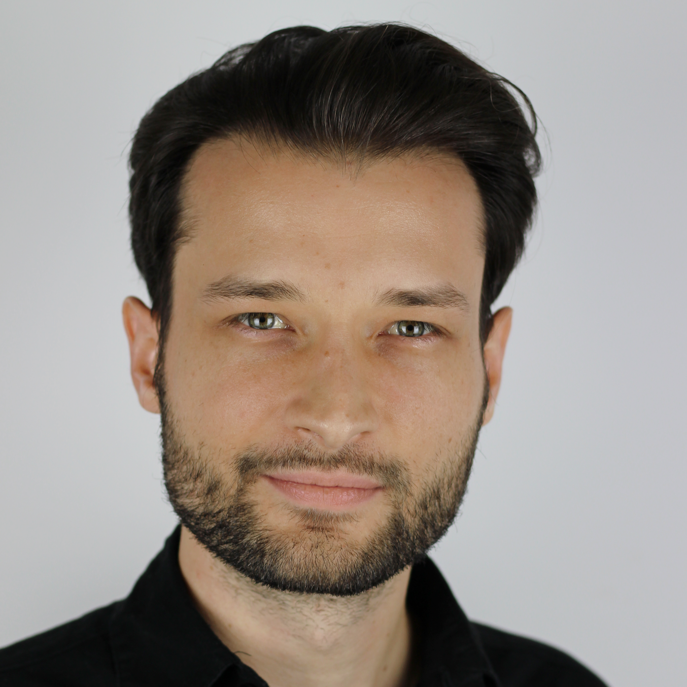

 

# Proč EAGxPrague?
Cílem konference je seznámit Českou veřejnost s myšlenkou efektivního altruismu a sjednotit síly podobně smýšlejících lidí.
Toho chceme dosáhnout vhodnou volbou přednášek a také stylem konference. Na své by si měli přijít jak <i>altruisté-začátečnici</i>,
tak i ti, co už se s tímto hnutím v minulosti potkali nebo se v něm již angažují. Spolek pro Efektivní Altruismus
by tímto rád vytvořil dostatečně silnou základnu v České republice i pro dlouhodobější činnost.

# Program
Většina přednášek bude v anglickém jazyce.

## Úvod do Efektivního Altruismu

Efektivní altruismus je filosofie a sociální hnutí s cílem co nejefektivněji
zlepšovat svět pomocí zdravého rozumu a vědeckého myšlení.
Proč je ale vlastně efektivní altruismus dobrý nápad? A co to v praxi znamená,
být <i>efektivní altruista</i>?

Úvodní přednášku v češtině s popisem této filosofie a popisem základních
předpokladů a argumentů nabídne <i>Radim Lacina</i>. Radim získal prestižní
Bakalovo stipendium a nyní studuje filosofii a lingvistiku na St Hugh's College
na University of Oxford. Již od střední školy se angažoval v efektivní charitě
a je spoluzakladatelem Spolku pro efektivní altruismus, první EA organizace
v České republice.

## Efektivní pomoc nejpotřebnějším

Jeden z největších a nejznámějších globálních problémů je chudoba.
Miliardy obyvatel rozvojových zemí jsou zasaženy nebezpečnými nemocemi, nízkou
ekonomickou produktivitou a systematickým znečišťováním životního prostředí.

<!-- TODO: nicer and mobile styling -->

	<!--style="width: 180px;"> -->

S problematikou <b>výběru a implementace efektivních intervencí pro pomoc
nejpotřebnějším</b> nás seznámí
<i>Alix Zwane</i>, expert na veřejné zdraví a CEO <a href="http://www.globalinnovation.fund/">Global Innovation Fund</a>,
fondu investujícího do sociálního podnikání s cílem zlepšit životy a
příležitosti milionů lidí v rozvojovém světě. V minulosti pracovala jako
výkonná ředitelka <a href="http://www.evidenceaction.org/">Evidence Action</a> a jako Senior Program
Officer ve skupině pro globální rozvoj v <a href="http://www.gatesfoundation.org/">Nadaci Billa a Melindy Gates</a>,
kde vedla vývoj strategií pro tým Water, Sanitation, and Hygiene.

## Jaká bude naše budoucnost? Jak můžeme dalším generacím přenechat lepší svět?

Svět dnes prochází nebývalou periodou zrychlujícího se technologického
a ekonomického pokroku. Povede současný vývoj k rozkvětu civilizace a krásné
budoucnosti, nebo k přelidnění, destruktivním změnám klimatu, nebo dokonce
k jaderné válce?

<!-- TODO: grid -->

<i>Johannes Treutlein</i> je odpovědný za růst <a href="https://sentience-politics.org/">Sentience Politics</a>,
organizace, jejímž cílem je snižování utrpení všech rozumných bytostí.
Kromě toho pracuje na komunikaci a šíření myšlenky Efektivního Altruismu
mezi ochránci zvířat. Ve své přednášce bude mluvit o <b>pozitivních a negativních
scénářích naší budoucnosti</b> a i o tom, <b>jak dnes můžeme zvýšit šanci na co nejlepší společnou budoucnost.</b>.

## Jak vybrat kariéru, kterou co nejvíc pomůžeme světu?

Ohromnou část svého života trávíme v práci. Kvůli tomu je výběr naší
kariéry nebývale důležité rozhodnutí. Na příkladech jako Bill Gates se dá
ukázat, že zvolíme-li si tu správnou práci, můžeme skrz ni zlepšit nebo
zachránit mnoho lidských životů.
Ale jak si vybrat? Měla bych se stát lékařkou, nebo bych se mohla stát
podnikatelkou a svým výdělkem financovat tři jiné lékaře?

Výběr kariéry je velmi důležité rozhodnutí, které je snadné učinit bez tak
opatrného výběru a přemýšlení, jaké by si rozhodnutí takové velikosti
zasloužilo. Strategiemi pro <b>výběr kariéry, kterou pomůžeme ostatním</b>,
nás provede <i>David Goldberg</i>.
David osobně změnil svou kariéru: skončil studium v PhD programu, kterým by,
jak usoudil, měl pouze malý pozitivní vliv na svět. Založil organizaci Founders
Forum for Good, jejíž program <a href="https://founderspledge.com/">Founder's Pledge</a>
přesvědčuje zakladatele
budoucích úspěšných startupů, aby věnovali 2% svých budoucích příjmů na
efektivní charitu. Ke dnešnímu dny příspěvky dosáhly výše <i>186 milionů dolarů</i>.

## Dysracionalie - Proč inteligentní lidé dělají špatná rozhodnutí

Proč někteří lidé dělají špatná rozhodnutí? Ve své přednášce <i>Lucius Caviola</i>
vysvětlí, že testy inteligence neměří správně míru racionálního myšlení a
rozhodování. Studie naznačují, že korelace mezi IQ a hypotetickým "koeficientem
racionality" je slabší, než by se dalo očekávat. Lepší porozumění psychologii
racionálního myšlení nám pomůže lépe měřit a zlepšovat racionalitu, což je
schopnost nutná k efektivnímu dosahování našich osobních i morálních cílů.

<i>Lucius Caviola</i> je Director of Outreach v <a href="https://ea-foundation.org/">Effective Altruism Foundation</a>
a stará se o růst této organizace a organizace <a href="https://sentience-politics.org/">Sentience Politics</a>. Dokončuje
svá PhD studia na University of Oxford, kde se věnuje kromě jiných témat
výzkumu psychologie speciesismu a efektivního altruismu.
Dále spoluzaložil charitu <a href="https://reg-charity.org/">Raising for Effective Giving</a>
a EA hnutí v německy mluvících zemích.

## Jak mohou světu pomoci studenti

<i>Ollie Base</i> a <i>Nikita Patel</i> pracují pro
<a href="http://www.shicschools.org/">Students for High-Impact Charity</a>,
což je globální síť studentských klubů, jejímž cílem je zkoumání toho,
jak mohou studenti mít co největšího prosociální dopad. Jejich program se
zaměřuje speciálně na roli, kterou budou věda, technologie, inženýrství
a matematika (STEM) hrát v budoucím mezinárodním vývoji.
Ve své společné přednášce nám představí svou vizi a způsoby, jak mohou
studenti pomoci světu.

<i>Ollie Base</i> je student filosofie a psychologie v Kolíně nad Rýnem.
Poslední rok předsedal Effective Altruism Society Warwick a právě zakládá
místní organizaci v Kolíně. Ollie byl člen týmu, který zkompiloval
program SHIC a tomuto projektu dále na dálku přispívá.

<i>Nikita Patel</i> nedávno ukončila studia na University of Oxford s bakalářským titulem
z francouzského a německého jazyka. Pracuje v organizaci <a href="http://www.malariaconsortium.org/">Malaria Consortium</a>
a dříve stážovala v <a href="https://www.givingwhatwecan.org/">Giving What We Can</a>,
významném evaluátoru charit pro EA komunitu. Jeden rok učila v Rakousku
a poté zahájila výukové iniciativy pro syrské uprchlíky a pro znevýhodněné
žáky v Kampale.

## Osobní rady od zkušených efektivních altruistů

V průběhu dne budou Lucius Caviola a Johannes Treutlein poskytovat
*sloty na osobní setkání*. Oba jsou zkušení efektivní altruisté a mohou
vám například nabídnout rady s Vašimi vlastními projekty nebo s rozhodnutími
ohledně Vaší kariéry.

<h2 id='diskuze'>Diskuze</h2>

Kromě těchto a dalších zajímavých přednášek od českých i zahraničních speakerů
bude probíhat i neformální diskuze, například o tom, jaké
specifické možnosti efektivní pomoci existují pro Čechy a Češky.

# Otázky a odpovědi

<dl>
<dt>Efektivní altruismus zní zajímavě - kde se můžu dozvědět víc?</dt>
<dd>
Na webových stránkách Spolku pro efektivní altruismus můžete nalézt <a
href="http://efektivni-altruismus.cz/o-ea">krátký úvod do problematiky EA</a>, a
také <a href="http://efektivni-altruismus.cz/zdroje">seznam některých
podrobnějších zdrojů</a>. Také vřele doporučujeme stručný, ale výstižný článek Šimona Podhájského <a href="http://efektivni-altruismus.cz/altruismus-2.0/">Altruismus 2.0.</a> 
Nevadí-li vám anglický jazyk, pak navštivte oficiální stránky efektivního altruismu: <a href="http://www.effectivealtruism.org/">http://www.effectivealtruism.org/</a>.
</dd>
<dt>Co znamená <b>EAGx</b>?</dt>
<dd>
EAGx je anglická zkratka pro <i>Efective Altruism Global X</i> (více informací například <a href="https://www.eaglobal.org/eagx/">zde</a>). V rámci tohoto programu se po celém světě konají konference, které se snaží rozšířit myšlenky Efektivního altruismu mezi co nejvíce lidí. A jedna z znich je právě <b>EAGxPrague</b>!
</dd>
<dt>Bude na konferenci občerstvení?</dt>
<dd>Ano - na konferenci bude zajištěný catering na celý den. Strava bude vhodná i
pro vegetariány i vegany.</dd>
<dt>Kolik stojí vstupné?</dt>
<dd>
	150,- Kč pro studenty a lidi pracující v neziskovém sektoru. Pro všechny ostatní 400,- Kč.
	Ve spolupráci s Paralelní Polis nabízíme i možnost <i>platit vstupné
	Bitcoinem</i>.
</dd>
<dt>To je moc... Rád bych se zúčastnil(a), ale vstupné si nemohu dovolit.</dt>
<dd>Tak pak nám napište e-mail na <a href="mailto:prague@eaglobalx.org">prague@eaglobalx.org</a> a určitě něco vymyslíme ;-) .</dd>
<dt>Co konkrétně můžu udělat, když chci pomoci?</dt>
<dd>
Některé způsoby máme uvedené <a href="http://efektivni-altruismus.cz/jak-pomoci">na stránkách Spolku pro efektivní altruismus</a>.
Doporučujeme však, abyste místo darování hned se nejdříve informovali
podrobněji o problematice a sami si pečlivě rozmysleli, jaká organizace může
Vaše úsilí nebo Vaše prostředky použít nejefektivněji. K tomu účelu
můžeme doporučit knihu <a href="http://www.effectivealtruism.com/">Doing Good Better</a> od filosofa Williama MacAskilla.
Máte-li zájem, rádi s Vámi také budeme spolupracovat v rámci Spolku pro
efektivní altruismus - stačí se ozvat na <a href="mailto:efektivnialtruismus@gmail.com">efektivnialtruismus@gmail.com</a>.
</dd>
<dt>Nedozvěděl jsem se {doplňte}.</dt>
<dd>V tom případě se neváhejte doptat na <a href="mailto:prague@eaglobalx.org">prague@eaglobalx.org</a> a nebo na Facebooku. </dd>
</dl>

# Sponzoři

Děkujeme panu Janu Bártovi a panu Václavu Dejčmarovi za štědrou finanční
podporu.

Velký dík patří projektu <a href="https://www.paralelnipolis.cz/">Paralelní Polis</a>
za poskytují prostor a technického vybavení za sníženou cenu a za umožnění
platby za lístky Bitcoinem.

# Kontakt

Máte-li otázky, které jsme zde nezodpověděli, návrhy, nebo máte-li zájem
nás podpořit v naší činnosti, můžete nám napsat na
[prague@eaglobalx.com](mailto:prague@eaglobalx.org).

Konferenci EAGxPrague organizuje [Spolek pro efektivní altruismus](http://www.efektivni-altruismus.cz/kontakt).
